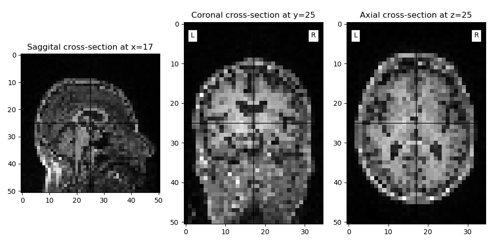

.. _getting_started:

----------
Motivation
----------
Nitorch aims to not only speed up your model training and evaluation routines, but also to ensure a scientific standard.
By loading data, training and evaluating models, nitorch assures correctness of the methods used as well as
reproducibility and comparability of routines within a project, but also across studies.

---------------
A small example
---------------
The following will give you an idea how to combine nitorch in your daily work:
Let's assume we want to train a simple model using our OASIS example dataset.
(https://github.com/derEitel/nitorch/data/OASIS_BIDS_example_data)

Let's start with necessary dependencies. Make sure you have the following packages available.
Also you should have successfully completed nitorch installation.

.. literalinclude:: example_code/small_example.py
    :linenos:
    :lines: 1-9, 16-19
    :language: python

We first define a simple model. We therefore use a practical base class which will soon be integrated
in the nitorch library.

.. literalinclude:: example_code/small_example.py
    :linenos:
    :lines: 223-384
    :language: python

And now the actual important task. Training and evaluating the model. We simply need the following to get started:

.. literalinclude:: example_code/small_example.py
    :linenos:
    :lines: 387-408
    :language: python

Result would be the following:

.. literalinclude:: example_code/small_example_out.log
    :linenos:
    :lines: 1 - 18

We now use our model class definition from above to get an instance of our DemonstationModel.
We initialize the weights by simply calling :code:`my_net.apply` with :code:`weights_init` from
the nitorch libarary. After choosing a suited criterion, optimizer and a metric
(additional to loss), we setup a trainer and simply run the training.

.. literalinclude:: example_code/small_example.py
    :linenos:
    :lines: 410- 436
    :language: python

The trainer functionality reports for every epoch (first number in []-brackets) and data-counter
(second number in []-brackets) the training loss, as well as the validation metrics for the validation
data set. Additionally, the total runtime is tracked.

.. literalinclude:: example_code/small_example_out.log
    :linenos:
    :lines: 20-102

Nitorch offers the possibility to visualize what has happend during training:

.. literalinclude:: example_code/small_example.py
    :linenos:
    :lines: 438-439
    :language: python

By calling :code:`trainer.visualize_training` with the :code:`report` we got as a result of the
:code:`train_model` call, we get the following visualization:

Usually, after training a model is validated using different data than involved in the training process.
Since our dataset is very small we demonstrate the evaluation behavior with the same data we used during
training.

.. warning:: Do not use data involved in training for model evaluation as done here for demonstration purposes!

Nevertheless, the following lines would lead to a model evaluation:

.. literalinclude:: example_code/small_example.py
    :linenos:
    :lines: 441-444
    :language: python

Since our :code:`prediction_type` is set to :code:`binary` we get results back as confusion matrix:

.. warning:: The evaluation dataset is so small, there are only control patients in the set. Always make sure the dataset is balanced. Nitorch offers a option for that as well! See data class documentation for further details.

